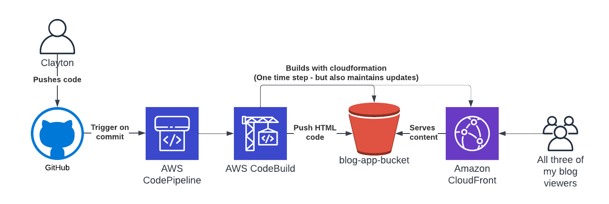

For the first blog, less of an opinion piece and more of a “how does this work” piece. I will run through how I set up this blog.

## Requirements

As with any good project, I started off with a few requirements for this blog. 

The first was the ability to host this in a serverless environment (S3, Cloudfront, Lambda, etc). I don't expect much traffic to this blog and I wanted to keep my cost down. Almost everything that I self host is hosted in this manner because I don't like to give all of my money to AWS and managing servers is overrated.

The second was something that would be simple to use. I am a builder at heart, a maintainer, I am not. So I needed something simple to set up that I could build into a pipeline so that maintenance effort approaches zero.

The third was the ability to automate. This goes hand in hand with the second point, but in the spirit of "know thyself", if I have to manually deploy anything, there is little chance that I am going to keep up with this. Also the builder in me loves to automate.

Enter [Hugo](https://gohugo.io/). It is a markdown, folder based website builder which makes it pretty simple to store in git. It has a ton of [free themes](https://themes.gohugo.io/) which makes it easy to look nice (caring about functionality over design is also a flaw of mine). It has a [command line](https://gohugo.io/commands/hugo/) which makes it pretty simple to set up and use. In the 24 hours of playing with it, I have been pleased with its simplicity and ease of automation.

## Pipeline and Automation



Automation for all the things is always my goal. I tend to default to AWS built in tools because I am already paying for AWS and they are simple and easy to use. This is a fairly similar pattern that I use for other personal projects because it makes maintaining them a breeze. GitHub repository, hooked up to AWS CodePipeline and CodeBuild and auto triggered on a commit into `main`.

AWS CodeBuild will do several things. The first is that it deploys any of the AWS infrastructure I need using Cloudformation. This makes it incredibly easy to update should I need to update anything. It also makes it easy to deploy again. The template for this Cloudfront/S3 bucket combo was borrowed from my resume site which I am sure I borrowed from some other project I did before that. Infrastructure as code is as much about maintainability as it is about reuse.

The second thing that AWS CodeBuild will do is build the Hugo code (`hugo -D`) and push it into the S3 bucket that it just deployed. It uses the Cloudformation outputs to dynamically pull the name of the bucket, once again, great for reuse on future projects if the pipeline code is also reusable and doesn't contain a lot of hard coded values.

```
BUCKET=$(aws cloudformation describe-stacks --stack-name $STACK_NAME --region us-east-1 --query "Stacks[].Outputs[?OutputKey=='Bucket'].OutputValue" --output text)
```

The final thing that it will do is clear the cache on Cloudfront, because ain't nobody got time to wait for that.

Source can be found [here](https://github.com/davis190/blog-app). The pipeline file is [here](https://github.com/davis190/blog-app/blob/main/aws/buildspec.yml).

As always - any questions, comments, suggestions for improvement I would love to hear them. You can reach out to me anyway that you know how. If you don't know how, you can email me -> blog@claytondavis.dev.

