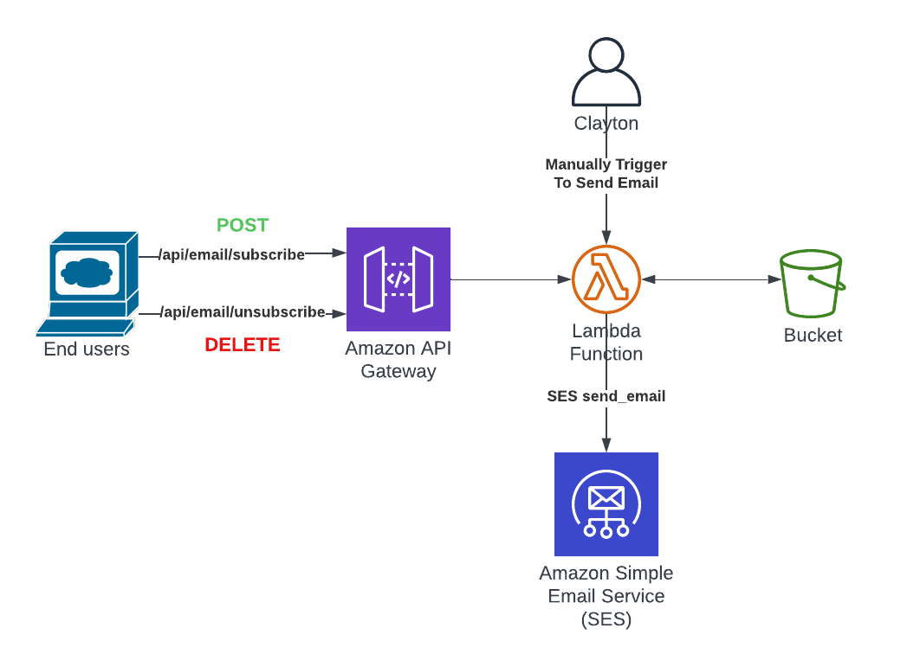

Everyone can calm down now, email notifications are here. So many of you (it was one person) have been asking for it. And if I am being honest, what blog doesn't have a subscribe feature. Silly, super easy to use and deploy framework that doesn't have a built-in subscribe feature (because it requires no infrastructure). Anyway - this post will walk you through how I built this custom, cloud-native, serverless, buzzword buzzword, subscribe feature.

Going to take a little bit of a different approach to this blog and try and make it a more technical write-up.

# Requirements

Like with any project - requirements are a pretty solid place to start. I had just a few.

1. Low cost - this automatically rules out any additional services that I would have to pay for. Also, that would have made this write-up much different.
2. Continue being serverless - I did not want to spin up a server just to send emails. Gross.
3. Ability for users to self subscribe and unsubscribe - obviously. Weird that this one was #3, but pretty important nonetheless. 


# Architecture

I decided immediately that I would use API Gateway and Lambda for the subscribe and unsubscribe functions. I have used them for many other projects, they are cheap, their cost should approach $0 when no one is using them which given their nature, should be most of the time.

The harder decision was where to store the data. A full-blown relational database was out of the question. I wasn't building a CMS system, I just needed to store email addresses. DynamoDB was my next thought, but the more I thought about it, the more that was overkill too. I wasn't actually going to query this data. I just needed to store a list. I ended up using S3. There is a bucket, with a single file, that has a list of email addresses. Simple, eloquent, cheap. *mic drop*.

Other services used as part of this include Amazon Certificate Manager for SSL, SAM & Cloudformaiton for IaC, Cloudwatch for logging, Simple Email Service to send out emails.

Take all of those services, shaken, not stirred, and you end up with something like this.



# The Nitty Gritty

Let's dive into the solution - it can all be found [here](https://github.com/davis190/blog-app/tree/main/aws/infra) in the same repo as the blog code. 

This entire solution is written in python, deployed using SAM, and most of my variables are pushed into the code under environment variables. Let’s dive in.

## Subscribe function

This is triggered from API Gateway on a `POST` to `/api/email/subscribe`

Start with downloading the file from S3. This is the file that contains the subscription list. Basic text file - one email per line

```
client = boto3.client('s3') 
email_file = '/tmp/email-list.txt' 
client.download_file(os.environ['BUCKET_NAME'], os.environ['EMAIL_LIST_KEY'], email_file) 
```

Loop through the downloaded file and figure out if the email is already subscribed. No need to have people receive double emails.

```
exists = False 
file_input = open(email_file, 'r') 
Lines = file_input.readlines() 
for line in Lines: 
    if line.strip() == email.strip(): 
        exists = True 
```

If they were not already subscribed, then add them to the list in the file. Don't forget the new line.

```
if not exists: 
    file_ouptut = open(email_file, 'a') 
    file_ouptut.writelines("\n"+email.strip()) 
    file_ouptut.close() 
```

Finally, push the file back into S3
```
client.upload_file(email_file, os.environ['BUCKET_NAME'], os.environ['EMAIL_LIST_KEY'])
```

## Unsubscribe function

This is triggered from API Gateway on a `DELETE` to `/api/email/unsubscribe`

This function is pretty similar, the only real difference is when we loop through the file we check to see if the email on the line we are reading matches the email we are trying to unsubscribe. If it does NOT match, then we write the line it to a new file. If it DOES match, then we skip it and do not write it. We end up with a brand new file minus the unsubscribed email and we write that one into S3.


```
new_file = '/tmp/email-list-new.txt'

file_input = open(output_file, 'r')
Lines = file_input.readlines()

file_ouptut = open(new_file, 'w')
for line in Lines:
    if line.strip() != email.strip():
        file_ouptut.writelines(line)
file_ouptut.close()
```

## Send email
This function is triggered manually through the lambda console passing in an object that looks like the one below.

```
{
    "subject": "This is my subject",
    "body": "Please enjoy this content
}
```

This function does the same file download, the same looping over every line, except this time it uses the [SES SendEmail](https://boto3.amazonaws.com/v1/documentation/api/latest/reference/services/ses.html#SES.Client.send_email) function to send out an email to that address with the body and subject we passed it. 

This is manual because I couldn't decide on a good trigger to send an email. To do it automatically when a new blog goes live I would have to trigger it when I push code, but I am pushing code for this subscribe function too and I don’t need emails triggers for things like that. I also push my posts to save my progress prior to publishing. Not the best trigger. What about on a merge into master? Well, I am a solo developer - I am not going to set up a best practice branch and code review strategy for myself. So for right now, as few times as I plan to push a blog. Manual will work.

## Hugo/HTML Updates
This was arguably the hardest part. I write APIs and lambda functions all the time, and I hate front-end work. Unfortunately, I did not dive that deep into Hugo when I set it up so I had (have?) no idea how to add raw HTML to these markdown documents. I ended up just adding the subscribe feature in the footer, a section that already existed on every page, to make it easier on myself. Made it a simple text box + button. Doesn't get much simpler.

I created a new javascript file that gets loaded in. It does two very simple things

### Subscribe

When you click on the button - it sends an API call with that email in the body to be subscribed. Easy. I also added a popup that tells you it was successful because user experience is important (at least people tell me that).

### Unsubscribe

This one was a bit more complicated because, like any good subscription service, I needed a link in the email to allow people to unsubscribe easily. So I created an unsubscribe page. 

The javascript for this page is where all the magic happens. On load, it checks to see if there is an `email` url parameter. If there isn't, then nothing happens, but if there is, then it takes that parameter and sends it to the unsubscribe endpoint.

For user experience, the text on the page will change to let you know it was successful.

One downside - there isn't a way to unsubscribe without clicking on that link or knowing the page exists (since it is hidden) and how to use it. Could I fix this? Of course! Will I? Maybe later.

## Additional steps

### SES Sandbox

By default when you stand up SES it is in sandbox mode. Sandbox mode means that you can only send emails to approved emails/domains. Neat feature, but I hate that it is the default. In order to get out of sandbox mode, you have to submit a support ticket and explain yourself. Why are you sending emails? What will these emails contain? How will you handle complaints and bounces? What is the middle name of your second child?

Anyway - it is a hassle, and very manual.

### ACM Certs

If you haven't used AWS Certificate manager for SSL certs, you are missing out. So incredibly easy to use. You give a list of domains for the cert, it spits out some DNS records for DNS validation. I use Google domains and the confirmation is basically instant on the AWS side. Anyway, I did this step manually as well because it is a one-time step and I can't (easily) automate Google domains in SAM.

## But what about the functions you didn't mention in your lambda?

If you look at the code you might notice I skipped over some functions - let me hit them at a high level here.

### Handler

This is the entry function for the API. I just use this to direct traffic to the correct place. If it is `/api/email/unsubscribe` and the method is `DELETE` then send to the unsubscribe function. It is is `/api/email/subscribe` and the method is `POST` then send it to the subscribe function. If it is anything else - return an error.

### Check email

Regex function to figure out if I got a valid email address. I don't do much error handling, but let's at least make sure it is valid email address.

### API response

I like to centralize the API response. This is the function I can call to do that.

# Conclusion

A little bit of a different, in detail post here. Hopefully, you enjoyed it. If you did, would love to hear. If you hated it, let me know too. blog@claytondavis.dev

Also if there is anything you care to hear me write about in blog form, would love to hear that too. Running out of "how I built this blog" posts to use, so hopefully some different content coming soon.
