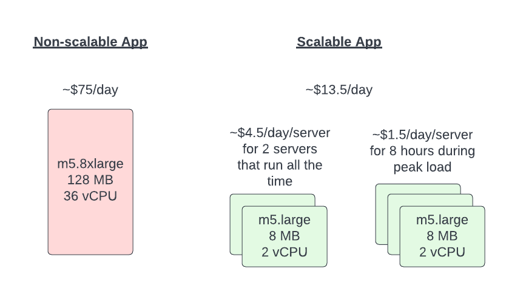

I recently took a new role as the director of the Cloud-Native Applications team at Caylent. This team is in charge of not only helping our clients build new applications but also modernizing their existing applications to better leverage the cloud. This DOES NOT mean we help our client pick up a monolithic application and all of its coupled dependencies and migrate it to an EC2 instance (we have another team for that). But we help our clients realize why the monolith is not sustainable and why they should be investing in moving away from it.

# What is a monolith?

Many of us have heard the term "monolithic" application. If you look it up you might find a definition that contains something like

> A single application that can perform all functions independently of other applications/processes.

This definition doesn't seem all bad, right? Wrong! I am here to tell you that in today's modern cloud ecosystem, monolithic applications have no place. While having things centralized might be nice, I am here to tell you that there are more cons than pros. 

Let's start by trying to figure out if your application might be a monolith.

## Single Codebase/Repository

Is all of your code in a single repository? Is that repository also stored using SVN (subversion)? Does that repository get deployed to a single server or generate a single artifact?

## Inability To Scale

Is your application incapable of scaling? Did you answer no to the previous question because you scale by deploying your application to a larger server with more horsepower (memory/compute)? Is your application the definition of a single point of failure?

## Legacy Codebase

Is it difficult for you to find developers that can work on your codebase? Are you using a version of software that is not only no longer being developed but is also out of support? Is your application deployed on Windows Server 2008 and can't run on a more modern operating system?

## Manual/Painful Deployments

Are you still requiring weekend deployments of your application? Do you still have extended periods of downtime to make a production release?

## Single Point Of Failure

Could a single bad line of code or missing semicolon take down your entire application? Does a 3rd party endpoint becoming unavailable cause your application to crash?

# Are we stuck in our monolithic ways?

The good news is that there are cures for the monolith. Not all of them are quick and easy, but oftentimes there are "low hanging fruit" or items that can be addressed quickly to allow immediate benefits. It might be to allow you to scale your application, better resilience to failures, better DR, less painful deployments, etc. The transformation of a monolith is not something that happens overnight, but it also doesn't have to be a "rewrite the entire codebase" type of effort either. 

Below let's address a few of the ways to start out on this journey.

## Scaling

In my opinion, this is the biggest downside to monoliths in the cloud. The cloud gives you all of these elastic compute options and you are stuck on your single reserved instance that spikes up to 90% CPU during peak times and idles at 3% utilization outside of business hours. It is a good thing most finance people don't understand the cloud or they would be crying.

Larger servers are not the answer to scaling. It is expensive because you have to pay for that hardware 24x7 just to support your peak load. Scaling horizontally is the solution you want. The ability to bring in more compute when you need it and remove it when the load goes away. Not only does that mean you save money, but it also means that you can scale to meet higher peaks that you might have originally planned for.

Most monoliths were not designed to scale - let's take a look at some of the common reasons and how you can solve them.

### Local database/datastore

This is a common pattern where on-prem you were given a single server to run your application so you have to do everything on that server including your database and/or storage of files.  Over time your application has evolved to depend on those datastores more and more and it would be a major rewrite to decouple them.

#### Database

Well, this is generally easy - move them off. Amazon has so many options for managed databases. They are going to cost a little more because you are paying for separate compute, but there are a ton of benefits - automated backup/restore capabilities, managed patching, failover, high availability, and more. Not to mention that if doing this allows you to properly scale your servers you will be saving by using smaller instances.

> But I don't know how to migrate :(

Amazon has thought of it all. Give [AWS Database Migration Service](https://aws.amazon.com/dms/) a try. This is a purpose-built solution to help you get onto a managed service so you can stop managing your own server. If Amazon RDS won't work for you, try and simple backup up and restore method into a separate EC2 server purpose-built for your database.

#### Local File Store

If your application relies on local files, Amazon has several options again. [Elastic File System](https://aws.amazon.com/efs/) is often time the path of least resistance. It allows you to have a file share that you can map to your servers and can _ussually_ be added with minimal code updates. 

If you are looking to fix this "the right way", then something like [Amazon S3](https://aws.amazon.com/s3/) is going to be cheaper, more resilient, and globally available. This option however will require using the Amazon SDK in order to interact with S3 but is often 100% worth it.

### Local jobs

Another common pattern that stops applications from scaling is local jobs that run on the server. Maybe they are CRON jobs or maybe they trigger based on new files being created or based on certain events of your application. If you attempted to scale your server then these jobs would execute multiple times across the servers.

Several options here - 

#### CRON

If these jobs are scheduled-based jobs, these are perfect candidates to pull out of the server and refactor. These types of jobs make a lot of sense in a serverless model. Why pay for compute when you really only need it for a matter of seconds or minutes? If you choose to go down this path, it is also a great time to refactor and write them in a modern language, maybe split them out into their own repo.

#### Responses to local files

These types of jobs also become very simple to refactor if you move towards using S3 for your file store. S3 has the built-in ability to trigger actions based on file CRUD options. 

If you don't go this route, you still have options of refactoring the jobs and moving them outside of the server. You could use things like SQS to queue jobs and process them sequentially making sure nothing is being processed more than once. You would refactor the jobs to store their state/status centrally so that they are aware of other executions that might be processing the same things.

A lot of modernization options for jobs like this.

## Microservices

We could spend an entire blog series talking about microservices, and I don't want to do that here. The main thing I want to call out is if you have problematic pieces of your monolithic application, those are often the best pieces to start breaking out into microservices. They might be difficult, but they often time comes with the biggest reward in the end.

Imagine for a second that you had an eCommerce type of application, and when you released products you announced the day and time way ahead of time creating demand. However, every time one of those releases happened your checkout process was incapable of handling the spike in load. This would be an ideal candidate to break out into a scaleable microservice. Allow the rest of your application architecture to remain unchanged, and add the scalability needed to the checkout process.

This method of breaking down a monolithic app is called the Stangler Pattern - google it.

### Single Repository / Legacy Code / Can't hire people

This, in my opinion, can be fixed the same way as the microservices approach. As you break pieces off of your application, it is the perfect time to rethink the tech stack. Obviously, they need to be able to interact with legacy components, but if you connect services with a queue or in a restful way there is no reason your legacy PHP monolith can't interact with some nodejs microservices.

While you are breaking things into microservices, this is also a great time to think about repository structure, deployments, automation, automated testing, releases, etc. It frees you from the way you have been doing things in the past. Anyway - getting carried away here. Microservices can solve a lot of problems, maybe there will be more blogs on that in the future.

## Deployments

Monolithic application deployments are often some of the most painful deployment horror stories. These applications often require you to deploy the entire application for every update. This can be timely and require downtime.

By doing some of the refactoring mentioned above you have a chance to look into patterns like blue/green or canary. The ability to use patterns like this means that you can get away from overnight or weekend deployments. You can have easy and simple rollbacks. 

Taking it a step farther, if you move to a more microservices approach (mentioned below) you can get into patterns where instead of deploying the entire application every time

Unfortunately, trying to automate/fix deployment issues without looking to refactor a monolithic application can often make things more complicated

# Conclusion

This one covered a lot of ground, and there is still probably a lot of ground unturned. Monoliths are truly a problem, but one that can be solved. Most organizations choose not to address it because it isn't a problem yet. Always better to be ahead of the curve.

As always, would love to hear your thoughts on the matter - blog@claytondavis.dev
