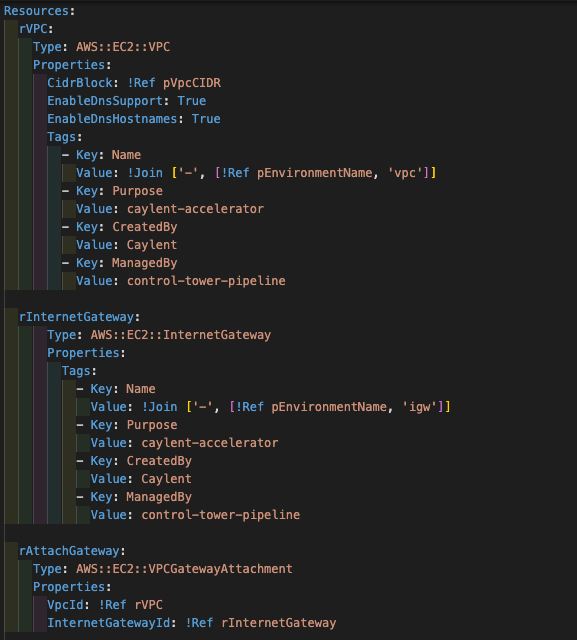

_Can also see this blog post [on the Caylent blog](https://caylent.com/blog/aws/getting-started-with-infrastructure-as-code)_

Part of my day-to-day job is reviewing proposals for our sales team prior to them presenting them to our clients. One of the things I see in 99.9% of proposals is Infrastructure as Code (IaC). Even if a customer can't spell IaC, at some point during the sales cycle, we convince them that it is critical to their success in the cloud. This might sound like an upsell, or consultants playing tricks, but this TLA (three-letter acronym) is critical. So what is it? Why is it so important? And where do I download the IaC.exe to use it?

# What is IaC?

BC (before cloud), people used to order hardware for their data center. They probably had a vendor and/or manufacturer they liked to use and a certain set of specs that they normally ordered when they needed more space. It was most likely a repeatable process to order one of those "same old" servers for the data center. Send in the order form that you have filled out a million times or call up Joe from the vendor who knows exactly what you need. It gets shipped, you receive it, you rack it, and you are good to go in 7-45 business days.

Infrastructure as code is kind of like that, except there is no middleman for you to work with. Instead of that order form you might fill out, you write down all of those specs in a JSON or YAML document and then your cloud provider processes that and all of the sudden you have a set of hardware provisioned. In minutes. 

While this is a simplified version, it really is as simple as that. IaC is the process of instead of clicking through a GUI to create resources in the cloud, you write them down as code. This allows you to create the same thing over, and over, and over with no manual errors. It also allows you to save it so that your colleagues can deploy that exact same thing in the “win the lottery” scenario.

# Why is it so important?

The cloud has enabled us to move faster than ever on innovating and creating. The only thing that is going to stand in our way is us. IaC is critical to this, and let me give you a few reasons why.

## Repeatability

Most companies have a concept of a dev environment, maybe a stage/qa/testing environment, and then a production environment. In years past building a new environment used to take a day up to weeks, but with IaC, if you invest the time up front to build dev with IaC - then you can use that same template for all of your future environments. You can deploy new environments in minutes or hours.

Now let's say you want to come out with a new product that is going to use the same tech stack, just have different code running - use the same IaC again to build it for the new product in all of your environments. All of the sudden your speed of innovation is up.
That new product didn’t work out - press the delete button, and now you are saving money in minutes.

## Shareability

The new wave of IaC that is coming out is all about shareability. Creating common modules for your company so that you can standardize how you do things. You want all servers to follow a naming convention - build a module that enforces that and start using it. You want all of those servers to also add a cost tag - update your module to enforce a cost tag. It is also much easier to teach your infrastructure to people using a combination of code and diagrams that it is to have them browse around the console.

Jim on that other DevOps team is deploying a cloud native serverless application using IaC, if you also want to deploy a similar app, reuse his IaC and replace the code that is being deployed. You don’t have to recreate the wheel. Gone are the days of screen sharing and having someone tell you what buttons to click to get your server to “do that thing”.

## Traceability

Once you start to use IaC, you can start to enforce it. Some common patterns are to now force anything being deployed in higher environments (staging/pre-prod/prod) to be deployed using IaC. When you follow this pattern then you can start to track changes to your IaC. Who did what, when, who approved it, when did it change, etc. While in AWS you can do this with cloudtrail - with IaC it becomes a lot easier just looking at it in source control. Better yet, follow good pull request/gitops patterns and all of the sudden you have an approval process for infrastructure changes too!

## Automation

Automation in anything usually results in being less error prone. The same is true for IaC. If you are relying on a person to click through the console and press 20 buttons to deploy a service, it is likely that they will forget one. IaC is going to be the same every time, no mistakes.

# Flavors of IaC

One of the questions we get asked often as consultants is "what IaC should I use". I have given this workshop many times to many clients, but you are about to get it for free! Some of these are pretty AWS specific, because that is the ecosystem that I live in, but hopefully it is useful.

## CloudFormation

(CloudFormation)[https://aws.amazon.com/cloudformation/] - the AWS native IaC tool. This is where I suggest that everyone (start)[https://aws.amazon.com/cloudformation/getting-started/]. CloudFormation is the easiest to start with and do correctly. It requires no additional setup. The errors are generally pretty helpful. It's easy. You get your choice of JSON or YAML (choose YAML). There are some WYSIWYG editors in the console that I have never used but they exist if you want to try those out.

CloudFormation is pretty useful to understand as it ends up being the base for some of the other IaC examples we will talk about in a bit.

## Terraform

[Terraform](https://www.terraform.io/) is a "cloud agnostic" IaC tool built by HashiCorp. I air quote cloud agnostic because I _hate_ when people choose Terraform and that is their only reason. Sure, you can deploy to GCP and AWS using Terraform, but you have to rewrite 100% of your code, the same way you would if you used the AWS native CloudFormation. _step off soap box_

Terraform, because it is a third party, uses the AWS APIs to create everything for you. Also because it is a third party, it has to manage the [state](https://www.terraform.io/language/state) of everything deployed in its own way. Meaning - when you deploy a server, it deploys it and then will save the ID (and other metadata) of that server. It does this because if you come back and want to edit your IaC and add a tag to that server, Terraform needs to know the ID of the server in order to make the update-tags API call work and apply to the correct server.

Terraform state is probably one of the more annoying things about Terraform and why it requires you to know what you are doing. It is much harder for a novice to use terraform, because by default state is stored locally. If you lose that state, you lose the ability to edit or delete those resources (there are [ways around](https://www.terraform.io/cli/import) it if you lose that state, but it is a PITA).

Terraform also offers a [Terraform Cloud](https://cloud.hashicorp.com/products/terraform) that can be used to deploy your terraform code and store the state. It has been several years since I have used their Cloud and I generally prefer to manage state on my own using [S3 Buckets](https://www.terraform.io/language/settings/backends/s3) and DynamoDB.

> But you didn't mention anything about the state for CloudFormation? Great point! Because it is an AWS managed tool, it manages state for you automagically.

However, while state is annoying, there are some very nice things about Terraform. Because Terraform uses the APIs for building things, it will often beat CloudFormation to support new services and features. This fact has blown the mind of every cloud engineer at one point or another. Another one of the big selling points for Terraform is that allows some basic code like functionality in an otherwise declarative language. It allows you to do some [basic loops](https://www.terraform.io/language/meta-arguments/count) and [if/then logic](https://www.terraform.io/language/expressions/conditionals) within your code that CloudFormation does not. If you need 5 subnets created, you can simply have Terraform loop, while in Cloudformation you are going to copy/paste 5 times.

The final comment I have about Terraform is the [additional providers](https://registry.terraform.io/browse/providers). AWS is obviously the one I have used the most, but they have a huge list of other providers that you can write terraform code to manage. You might be able to write terraform code to deploy your AWS infrastructure and provision users in your AD environment. Tons of providers and even the ability to write your own.

## Serverless Application Model

The [Serverless Application Model](https://aws.amazon.com/serverless/sam/) (SAM) is really just a flavor (a [transformation](https://docs.aws.amazon.com/AWSCloudFormation/latest/UserGuide/transform-section-structure.html)) of CloudFormation. It gives you slightly different resources to deploy that make it easier to deploy serverless applications. I think this is best explained by an example.

To deploy a lambda function and expose it through API Gateway using CloudFormation you would need to deploy
- [AWS::ApiGateway::RestApi](https://docs.aws.amazon.com/AWSCloudFormation/latest/UserGuide/aws-resource-apigateway-restapi.html)
- [AWS::ApiGateway::Deployment](https://docs.aws.amazon.com/AWSCloudFormation/latest/UserGuide/aws-resource-apigateway-deployment.html)
- [AWS::ApiGateway::Stage](https://docs.aws.amazon.com/AWSCloudFormation/latest/UserGuide/aws-resource-apigateway-stage.html)
- [AWS::Lambda::Function](https://docs.aws.amazon.com/AWSCloudFormation/latest/UserGuide/aws-resource-lambda-function.html)
- [AWS::Lambda::Permission](https://docs.aws.amazon.com/AWSCloudFormation/latest/UserGuide/aws-resource-lambda-permission.html)
- [AWS::IAM::Role](https://docs.aws.amazon.com/AWSCloudFormation/latest/UserGuide/aws-resource-iam-role.html)

With SAM
- [AWS::Serverless::Api](https://docs.aws.amazon.com/serverless-application-model/latest/developerguide/sam-resource-api.html)
- [AWS::Serverless::Function](https://docs.aws.amazon.com/serverless-application-model/latest/developerguide/sam-resource-function.html)

It is really simplified for serverless deployments and makes the code much similar. The way it works is that CloudFormation takes your SAM IaC, and transforms it behind the scenes into CloudFormation resources to deploy. Magic.

## Pulumi / AWS CDK

I lump [Pulumi](https://www.pulumi.com/) and [AWS CDK](https://aws.amazon.com/cdk/) into the same bucket because for explanation purposes they are the same. You _might_ even be able to throw in [CDKTF](https://www.terraform.io/cdktf) into this mix, but the jury seems to still be out on CDKTF.

What sets these two apart from the rest is that when they refer to infrastructure as code, they mean CODE. Not some JSON/YAML/HCL file. With these tools you get to pick your supported language ([Pulumi](https://www.pulumi.com/docs/intro/languages/)|[AWS CDK](https://docs.aws.amazon.com/cdk/v2/guide/work-with.html)) and write real code. There is A LOT of power behind these options. You have all the flexibility and in a language that your developers might already know (if they don't know it, please don't pick a new language for them to learn).

Pulumi, like Terraform, uses the API. So once again you have a state to manage. They, like Terraform, also have [a cloud](https://www.pulumi.com/product/pulumi-service/). It has been a few years since I have used the Pulumi cloud, but I enjoyed my time in the Pulumi cloud more than I did in the Terraform cloud.

AWS CDK is backed by CloudFormation - so you write all of your code, and then the CDK translates that into CloudFormation for the actual deployment. It is nice because state management is included, but you will be tied to any limitations of CloudFormation.

AWS CDK, kind of like SAM, also has some [higher level constructs](https://constructs.dev/search?cdk=aws-cdk&sort=downloadsDesc&offset=0) that allow you to deploy commonly lumped together services with less code. The best example of this is a VPC. At Caylent, I think our standard secure VPC CloudFormation template is 85+ lines and includes the VPC, the subnets, the route tables, the NACLs, IGW, NAT GW, etc. It is also in CloudFormation so certain resources are copy/pasted 2-5 times depending on the VPC. In CDK you can deploy a standard VPC in 3-5 lines of code. 

One of the biggest caveats I tell customers when going with CDK/Pulumi is that you shouldn't just start writing infrastructure from day 1. There is some thought and planning that should go into how you are going to set up your code, should you write certain things as modules, how are you going to enforce standards, etc. This is a coding project, and should be treated as one. It will be much harder to undo in the future given that your production infrastructure might depend on it.

You should also take into consideration that not everyone who needs to interpret your IaC is going to be a developer. Sometimes people from security or ops will need to be able to read and understand your code. Oftentimes explainability and readability can be more important than [DRY](https://en.wikipedia.org/wiki/Don%27t_repeat_yourself) programming.

# Conclusion 

In conclusion everyone should use AWS CDK. kthx. Kidding, mostly. In reality I am more in the boat of everyone should use IaC. Pick the one that is right for you and your team to manage. Of the choices above there is no wrong answer. All of the solutions above are long term tools that are here to stay. I have done multiple projects with all of them, and I can tell you that they all work, work well, can be automated, and can be taught to teams.

