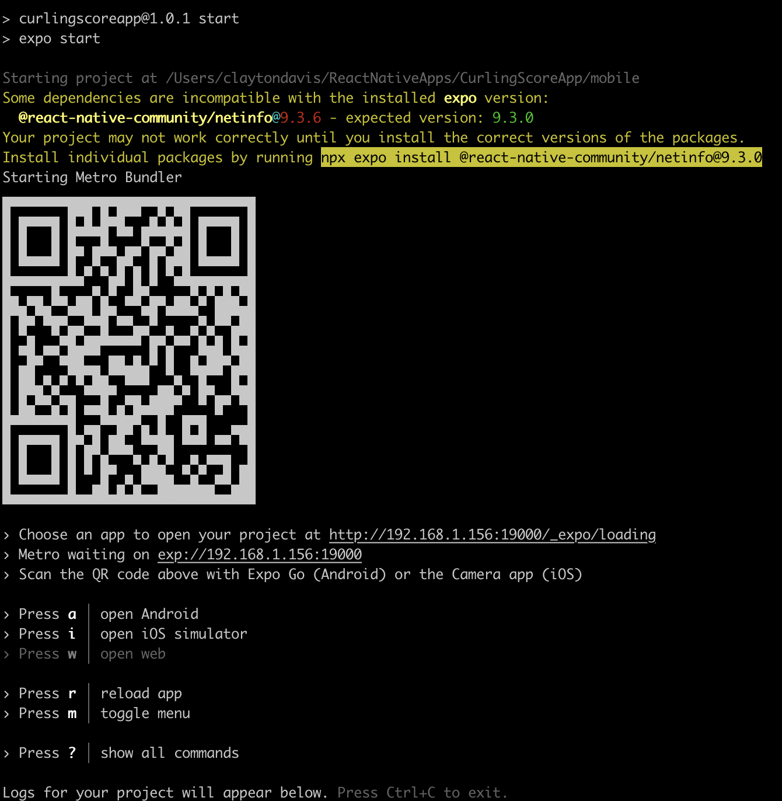

In 2022 over half of the traffic on the internet is generated by mobile devices. And behind a majority of those devices are users who prefer mobile-friendly/mobile-first development, and if they don't get it they are likely to take their business elsewhere. This is not a new trend, but a [trend](https://blog.hubspot.com/website/mobile-optimization-stats) that continues to become more and more prominent. Now we could talk about why this is or how it affects the industry, but I really just wanted to use it as a segway into this blog.

Enter my most recent hobby project (and now blog) - a mobile app or as you could call it, my first modern mobile app. 

Now before you jump to any conclusions - I know how mobile apps work. I have architected several of them over the last 5-7 years and built backends and cloud infrastructure to support them. But the last mobile app I personally wrote code for was in Java for Android 13+ years ago. I don't think these "multi-platform" approaches existed. I didn't care for Java, so I never did it again. Until now. So this is me, getting my hands dirty, and building all aspects of this mobile app "hobby project" because it is about time I dove back into the world of mobile.

## The Idea

Like any good hobby project, we start with a small idea that very quickly balloons out of control with scope creep. This idea stemmed from an app called [The Grint](https://thegrint.com/). If you are unfamiliar, it is a golf app that not only allows you to track your score but also every shot you take - club, distance, accuracy, hook, slice, etc. It then takes all of this data over time and tries to show you trends and averages. It has helped my (terrible) golf game a lot. Well, why doesn't something like this exist for my winter golf - curling? So, like any good tech person, instead of looking for a solution I decided to build one.


So in this blog, I really want to share how I got started building my mobile app, what pieces I found to be critical, and some surprises that I found along the way.

## The Tech Stack

Now before we dive too deep into the getting started part, figured I would take a step back and look at the tech stack as a whole of this monstrosity.

Mobile - React Native, Expo
Authentication - Cognito
Backend - Nodejs, lambda, API Gateway, SAM
Database - DynamoDB
Web - React, S3, CloudFront
Automation - GutHub, Code pipeline, Code build

Functionally, this app is pretty standard. Mobile app, backend, and web are all authenticated with Cognito. Mobile app is used for data collection and sends that data to the backend via rest API. All of that data is stored on Dynamo. Then that data is rendered on the front end currently doing some client-side analytics of the data.

### Expo

Now I had heard of React Native, I knew its capabilities and was pretty familiar with React in general, which made the choice of React Native pretty simple. Expo on the other hand was new for me. Expo was the biggest surprise of this whole process. Expo did two things for me.

The first and probably coolest expo feature is dev testing and debugging. Expo runs a local server, and assuming your phone is on the same network and has the expo app, you can connect to that server to run the app. The app refreshes in real-time as you make changes, making it much closer to web development. It also gives you the option to have a JS debug console in chrome to check your logs and errors as you run the app just like you would with a web app. 



The second piece that Expo offers is build servers. Expo provides [free build servers](https://expo.dev/pricing) for tinkerers such as myself. Up to 30 free builds a month which is 1/day. This to me is pretty wild. It was also awesome because I didn't need to mess with building the Android package, it was built for me. Expo provides a [configuration file](https://docs.expo.dev/build/eas-json/) that allows you to specify some options based on what "environment" you are build for.

## Getting Started

Now let's look at how to get started with this tech stack - like most react project is is pretty simple.

```
npx create-expo-app my-app
```

Once it is created you can run the below from inside the new folder to start and run your app.

```
npx expo start
```

Prerequisites being that you need to have Expo installed both on your development machine and on your mobile device. You can find more documentation [here](https://docs.expo.dev/get-started/create-a-new-app/) - I am not going to spend my time on this.

## Keys to a successful app

I want to share a few of my keys to a successful app that I found out the hard way. I found out the hard way mostly due to a lack of planning and ballooning requirements. I started out mostly just wanting to figure out how all of the things worked - not really thinking about the functionality fully. Going back and adding these things after the fact is a little painful, so I recommend starting with them.

### Centralized State

This one is really a no-brainer if you know React. I knew I would need this going in, but like most other things I just put it on the back burner.

For those who aren't familiar with React or state management - centralized state management can be thought of as a centralized database that lives locally within your app. You can access this database from any page to pull information or store information. This information can be as simple as `isComponentLoading` and you can use that boolean to show or not show a loading component. You can also store very large arrays of data like every shot taken during a curling game. This state allows you to navigate between pages without losing any data. State can exist globally using something like [redux](https://redux.js.org/introduction/getting-started) or per page using native React state management.

Highly recommend setting up redux and centralized state. SPAs (single-page apps) aren't really the method you want to go with mobile apps.

### Navigation 

Jumping off the last statement above how SPAs aren't really the wave in mobile, navigation is going to be important. React has a pretty robust navigation library that you can use called [@react-navigation/native](https://reactnavigation.org/docs/getting-started). It has all of the standard mobile navigation types built in - hamburger menus, bottom navigation, top navigation, etc. It also allows you to control page navigation based on responses from APIs or whatever it is you want.

This is probably equally as important on a web app - but planning your pages and how you navigate between pages is pretty important and can help you develop it quicker.

### Amplify

The last thing I will share is about [Amplify](https://docs.amplify.aws/lib/q/platform/react-native/). If you are going to do anything with AWS, start with Amplify. It has come a long way since the last time I used it and AWS seems to be pushing all mobile/web functionality into it. All of your Cognito functionality is built in - and after authenticating with Cognito you can give your app permissions to AWS so it can interact directly with AWS services.

The two things I used amplify for were Cognito and [Pub/Sub](https://docs.amplify.aws/lib/pubsub/getting-started/q/platform/react-native/). I am using Pub/Sub to enable communication between multiple mobile apps so that when one person updates anything about the game, it will sync to the other devices. My first time using PubSub in native AWS, and it is pretty slick.


## Conclusion

Shot blog, but I just wanted to share my experience with writing my first mobile app... in a while.

